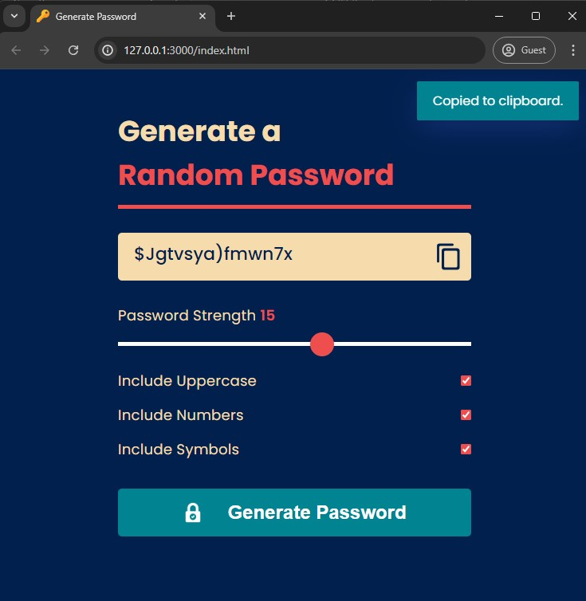

# Random Password Generator

A simple web application to generate random passwords based on user-selected criteria such as length, inclusion of uppercase letters, numbers, and symbols. This tool helps users create strong and secure passwords for their online accounts.

## Table of Contents

- [Demo](#demo)
- [Features](#features)
- [Installation](#installation)
- [Usage](#usage)
- [Acknowledgements](#acknowledgements)
## Demo




## Features

- Generate random passwords with customizable length (8 to 20 characters).
- Include uppercase letters, numbers, and symbols based on user preference.
- Copy generated password to clipboard with a single click.
- User-friendly interface with responsive design.


## Installation

To get a local copy up and running follow these simple steps:

1. Clone the repository:
   ```sh
   git clone https://github.com/aimless-coder/Random_Password_Generator.git
   ```

2. Open index.html in your browser

    
## Usage

- Open `index.html` in your web browser.
- Adjust the password length using the slider.
- Check the boxes to include uppercase letters, numbers, and symbols as needed.
- Click the "Generate Password" button to create a new password.
- Click the copy icon to copy the generated password to your clipboard.


## Acknowledgements

 - [toastify-js](https://github.com/apvarun/toastify-js) : A lightweight JavaScript library to show toast notifications.


